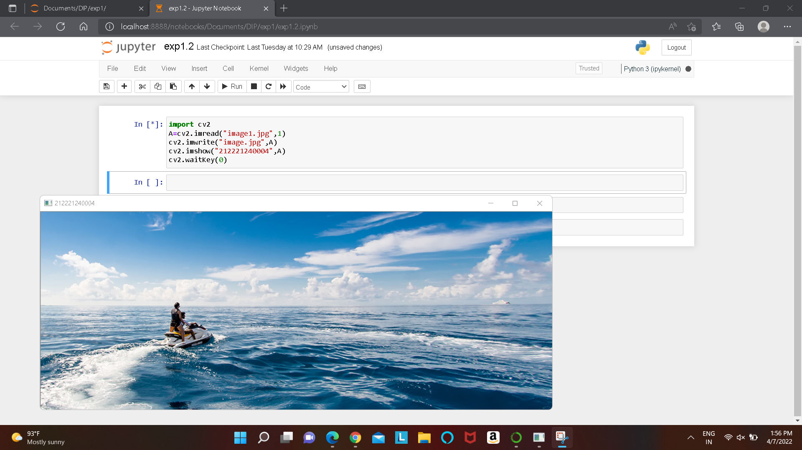
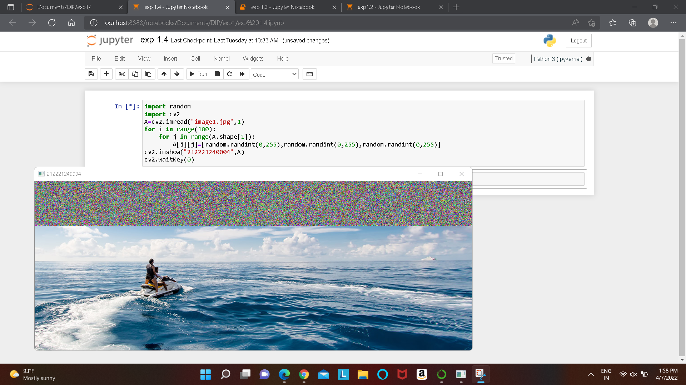
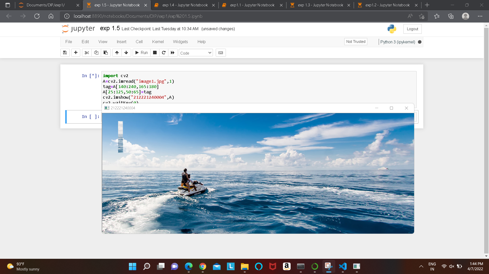

# READ AND WRITE AN IMAGE
## AIM
To write a python program using OpenCV to do the following image manipulations.
i) Read, display, and write an image.
ii) Access the rows and columns in an image.
iii) Cut and paste a small portion of the image.

## Software Required:
Anaconda - Python 3.7
## Algorithm:
### Step1:
Choose an image and save it as a filename.jpg
### Step2:
Use imread(filename, flags) to read the file.
### Step3:
Use imshow(window_name, image) to display the image.
### Step4:
Use imwrite(filename, image) to write the image.
### Step5:
End the program and close the output image windows.
## Program:
```
### Developed By:ANITHA P
### Register Number: 212221240004
i) #To Read,display the image

import cv2
A=cv2.imread("image.jpg",1)
cv2.imshow("212221240004",A)
cv2.waitKey(0)
```
```

ii) #To write the image

import cv2
A=cv2.imread("image.jpg",1)
cv2.imwrite("image.jpg",A)
cv2.imshow("212221240004",A)
cv2.waitKey(0)


```
```

iii) #Find the shape of the Image

import random
import cv2
A=cv2.imread("image.jpg",1)
for i in range(100):
    for j in range(A.shape[1]):
        A[i][j]=[random.randint(0,255),random.randint(0,255),random.randint(0,255)]
cv2.imshow("212221240004",A)
cv2.waitKey(0)
```
```


iv) #To access rows and columns


import random
import cv2
A=cv2.imread("image.jpg",1)
for i in range(100):
    for j in range(A.shape[1]):
        A[i][j]=[random.randint(0,255),random.randint(0,255),random.randint(0,255)]
cv2.imshow("212221240004",A)
cv2.waitKey(0)


```
```
v) #To cut and paste portion of image

import cv2
A=cv2.imread("image1.jpg",1)
tag=A[140:240,165:180]
A[25:125,50:65]=tag
cv2.imshow("212221240004",A)
cv2.waitKey(0)


```

## Output:

### i) Read and display the image


### ii)Write the image



### iii)Shape of the Image


### iv)Access rows and columns




### v)Cut and paste portion of image


## Result:
Thus the images are read, displayed, and written successfully using the python program.


